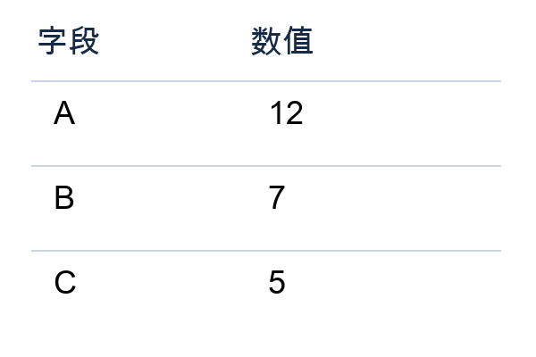
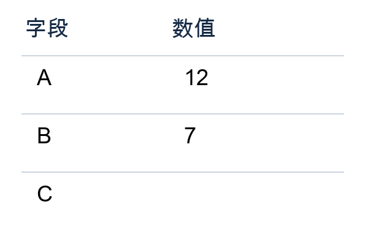

# Step 5 Preview 图像理解与结构化输出：从图片到可用 JSON

**简体中文** | [English](../en/README.md)

> 两种语言版本使用相同的示例输入、参数与检查规则。代码中的中文提示词、字符串和输出字段保留原样，便于对照运行。

## 1. 认识图像理解与结构化输出

Step 5 Preview 可以在同一条消息中读取文字与图片，并以文本回答。这里的“多模态”指模型能结合不同形式的输入；本篇用其中的图像理解能力读取表格。[模型与输入类型](https://platform.stepfun.com/docs/zh/guides/models/step-5-preview)

项目通常需要把读取结果继续交给程序。JSON Schema 用字段名、类型和必填条件描述目标对象，结构化输出据此限制返回形状。图片中的信息是否读对，仍需要结合任务内容判断。[结构化输出说明](https://platform.stepfun.com/docs/zh/guides/developer/json-mode)

本篇面向需要把图像提取接入 Python 项目的开发者。我们用三张小表格说明图片编码、`detail`、字段 Schema 和缺失值 `null` 的配合方式，最后将结果解析成 Python 对象。

**本文路线：** 准备图片 → 定义字段 → 发送图文请求 → 检查返回对象 → 替换图片与字段。

## 2. 前置条件与环境准备

### 2.1 前置条件

**需要掌握：** Python 函数、字典与 JSON；了解一次请求如何返回结果。不要求预先接入特定开发框架。

**需要准备：**

- Python 3.10 或以上版本、一个终端和任意代码编辑器。
- [StepFun 开放平台](https://platform.stepfun.com/)账号，已创建 API Key，并确认可以调用 `step-5-preview`。
- 可以访问所用区域 API 的网络环境。真实调用会使用账户额度。
- 样例图片：下文列出的三个 PNG，放在项目的 `assets/vision/` 中。

### 2.2 创建 Python 环境

已有项目可以使用现有虚拟环境。新项目可在任意工作目录创建环境。macOS／Linux 终端执行：

```bash
mkdir stepfun-demo
cd stepfun-demo
python3 -m venv .venv
source .venv/bin/activate
```

Windows PowerShell 执行：

```powershell
mkdir stepfun-demo
cd stepfun-demo
py -3 -m venv .venv
.\.venv\Scripts\Activate.ps1
```

激活后，用以下命令确认正在使用的 Python 版本。后文的 `python` 都指这个环境中的解释器。

```bash
python --version
```

### 2.3 安装本篇依赖

本篇请求和文件处理使用 Python 标准库，无需安装第三方 SDK。已经使用其他 HTTP 客户端的项目也可保留现有客户端，按正文提供的请求体接入。

### 2.4 配置密钥与运行方式

程序读取环境变量 `STEPFUN_API_KEY`。可以在 IDE 的运行配置或服务部署环境中设置它；本地未设置时，代码会在终端隐藏询问。密钥无需写进源码。

中国站设置 `REGION = "cn"`，使用 `.com` 地址；国际站设置为 `"global"`，使用 `.ai` 地址。密钥应与对应站点一致。

在项目中新建 `vision_demo.py`，将本文的 **Python 代码块按顺序放进这个文件**；`bash` 和 `powershell` 代码块只在终端执行。完成定义与调用后运行：

```bash
python vision_demo.py
```

代码按“连接配置、能力参数、调用、结果处理”分组。接入已有项目时，按这些分组复用函数，并在业务入口调用。配套 `.ipynb` 是相同代码的可选交互形式；普通 Python 文件包含本篇完整运行路径。

### 2.5 初始化连接与凭证

`BASE_URLS` 保存站点地址，`REGION` 选择本次连接。`get_key()` 只在环境变量缺失时询问密钥，适用于终端运行；服务中可直接从部署环境读取。

```python
import getpass
import json
import os
import time
import urllib.error
import urllib.request
from pathlib import Path

BASE_URLS = {"cn": "https://api.stepfun.com/v1", "global": "https://api.stepfun.ai/v1"}
REGION = "cn"

def get_key() -> str:
    key = os.environ.get("STEPFUN_API_KEY", "").strip()
    if not key:
        key = getpass.getpass("输入 StepFun API 密钥（隐藏输入，不保存到文件）：").strip()
    if not key:
        raise ValueError("未提供密钥，已停止。")
    return key

import base64
```

### 2.6 设置 HTTP 超时与响应读取

下面的 `post()` 是本篇公共请求函数。`HTTP_TIMEOUT_SECONDS` 控制一次网络操作的等待上限，是客户端配置；它与模型的推理强度或输出长度分开设置。函数返回响应字节、完整读取耗时和内容类型。

```python
HTTP_TIMEOUT_SECONDS = 90

def post(payload: dict, key: str, region: str = "cn", path: str = "/chat/completions"):
    request = urllib.request.Request(
        BASE_URLS[region] + path,
        data=json.dumps(payload, ensure_ascii=False, allow_nan=False).encode("utf-8"),
        headers={"Authorization": "Bearer " + key, "Content-Type": "application/json"},
        method="POST",
    )
    start = time.perf_counter()
    try:
        with urllib.request.urlopen(request, timeout=HTTP_TIMEOUT_SECONDS) as response:
            body = response.read()
            content_type = response.headers.get("Content-Type", "")
    except urllib.error.HTTPError as exc:
        # 不把请求头或服务端原始错误写进结果文件。
        raise RuntimeError(f"HTTP {exc.code}：核对区域、权限、额度及请求字段；本例不自动重试。") from None
    except (urllib.error.URLError, TimeoutError):
        raise RuntimeError(f"网络连接失败或超过 {HTTP_TIMEOUT_SECONDS} 秒；本次停止。") from None
    elapsed = time.perf_counter() - start
    return body, elapsed, content_type
```

`chat()` 将聊天响应解析成字典，`response_record()` 提取最终内容和用量，`save_json()` 保存本次结果。已有项目可以把这三项放到自己的响应处理层；它们不改变发送给模型的能力参数。

```python
def chat(payload: dict, key: str, region: str = "cn") -> tuple[dict, float]:
    body, elapsed, _ = post(payload, key, region)
    data = json.loads(body)
    if not isinstance(data, dict) or not data.get("choices"):
        raise ValueError("响应没有 choices，不能作为一次成功生成。")
    return data, elapsed

def response_record(data: dict) -> dict:
    choice = data["choices"][0]
    message = choice.get("message", {})
    return {"response_id": data.get("id"), "returned_model": data.get("model"),
            "finish_reason": choice.get("finish_reason"), "content": message.get("content"),
            "refusal": message.get("refusal"), "usage": data.get("usage")}

def save_json(path: Path, value) -> None:
    path.write_text(json.dumps(value, ensure_ascii=False, indent=2, allow_nan=False) + "\n", encoding="utf-8")
```

```python
api_key = get_key()
```

本篇使用随文提供的三张 PNG。把随文 `assets` 目录复制到自己的项目中，运行命令时以项目目录为工作目录。单独下载本文时，把下列图片保存在 `assets/vision/` 即可。图片是样例数据，读取和请求代码完整列在下文。

- [清晰表格 clear.png](../assets/vision/clear.png)
- [C 留空的表格 missing.png](../assets/vision/missing.png)
- [B 改为 9 的表格 adapted.png](../assets/vision/adapted.png)



## 3. 从一张图片得到结构化对象

### 3.1 定义字段和输出约束

三个字段均为必填，值允许整数或 `null`；不接受额外字段。`null` 表示图片没有给出可辨认的数值。参考答案用于结果核对，不写入请求。

```python
MODEL = "step-5-preview"
ASSET_DIR = Path("assets/vision")
IMAGES = [
    {"file": "clear.png", "expected": {"A": 12, "B": 7, "C": 5}},
    {"file": "missing.png", "expected": {"A": 12, "B": 7, "C": None}},
    {"file": "adapted.png", "expected": {"A": 12, "B": 9, "C": 5}},
]
for item in IMAGES:
    if not (ASSET_DIR / item["file"]).is_file():
        raise FileNotFoundError(f"请把随文图片放到 {ASSET_DIR}：{item['file']}")
```

**参数组：输出字段 `response_format`。** 三个字段均必填；每个值允许整数或 `null`。修改业务字段时，先在这里修改名称、类型和缺失值约定。

```python
SCHEMA = {"type": "object", "properties": {k: {"type": ["integer", "null"]} for k in ["A", "B", "C"]},
          "required": ["A", "B", "C"], "additionalProperties": False}
```

`required` 控制必填项，`additionalProperties=False` 约束额外字段。保留 `null` 后，图片缺少数值时程序可以明确表达缺失。

**参数组：图片细节 `detail` 与严格 Schema。** 本例起点为 `high`，适合观察表格中的小字；改变 `IMAGE_DETAIL` 时，固定同一图片与 Schema 比较结果。`STRICT_SCHEMA` 保持为真，使接口按给定字段结构输出。

```python
IMAGE_DETAIL = "high"
STRICT_SCHEMA = True

def request_for(image_path, model):
    raw = image_path.read_bytes()
    if not raw.startswith(b"\x89PNG\r\n\x1a\n") or len(raw) > 10_000_000:
        raise ValueError("本示例只接受小于 10 MB 的 PNG；这是示例自身的范围。")
    return {"model": model, "messages": [{"role": "user", "content": [
        {"type": "text", "text": "读取图片表格中 A、B、C 对应的数值。只依据图片；空白或无法辨认的值填 null，不要猜测。"},
        {"type": "image_url", "image_url": {"url": "data:image/png;base64," + base64.b64encode(raw).decode(), "detail": IMAGE_DETAIL}}]}],
        "response_format": {"type": "json_schema", "json_schema": {"name": "table_values", "strict": STRICT_SCHEMA, "schema": SCHEMA}},
        "reasoning_effort": "low", "max_tokens": 4096, "stream": False}
```

图片编码、提取指令与 Schema 在同一请求中组合。下方结果处理分别核对 JSON 解析、字段类型和参考值；这三步对应格式和内容两个层面。

```python
def grade(content, expected):
    try:
        obj = json.loads(content)
    except (ValueError, TypeError):
        return {"parse_ok": False, "schema_ok": False, "correct_fields": 0, "all_correct": False}
    valid = isinstance(obj, dict) and set(obj) == set(SCHEMA["required"]) and all(v is None or type(v) is int for v in obj.values())
    correct = sum(k in obj and type(obj[k]) is type(v) and obj[k] == v for k, v in expected.items()) if valid else 0
    return {"parse_ok": True, "schema_ok": valid, "correct_fields": correct,
            "evaluated_fields": len(expected), "all_correct": valid and correct == len(expected), "parsed": obj}
```

`request_for()` 把图片读成字节，再编码为 Base64 数据地址；文字指令和图片放在同一条用户消息里。`response_format` 指定严格 Schema，`detail` 使用 `high`。本例自行限定 PNG 小于 10 MB，便于直接观察输入与输出。

### 3.2 发出一次请求并查看字段

下面定义可复用的读取函数，然后处理第一张图片。

```python
def read_image(item):
    data, elapsed = chat(request_for(ASSET_DIR / item["file"], MODEL), api_key, REGION)
    row = {"file": item["file"], "elapsed_seconds": elapsed, **response_record(data)}
    row["checks"] = grade(row["content"], item["expected"])
    row["success"] = (row["finish_reason"] == "stop" and not row["refusal"]
                      and row["checks"]["all_correct"])
    return row
```

```python
clear_result = read_image(IMAGES[0])
print(json.dumps(clear_result, ensure_ascii=False, indent=2))
```

这张图对应的参考对象是 `{"A": 12, "B": 7, "C": 5}`。查看 `content` 里的实际结果，以及 `checks` 中的 `parse_ok`、`schema_ok` 和 `correct_fields`。它们分别回答：能否解析、形状是否正确、字段是否符合图片。

## 4. 解释关键选择，再观察空白字段

### 4.1 让缺失值有明确表达

第二张图的 C 单元格留空。提示要求与 Schema 都允许 `null`，这样下游程序可以显式处理缺失值。



```python
missing_result = read_image(IMAGES[1])
print(json.dumps(missing_result, ensure_ascii=False, indent=2))
```

这张图的参考对象是 `{"A": 12, "B": 7, "C": null}`。JSON 中的 `null` 解析到 Python 后是 `None`。

### 4.2 改字段时同步三处

| 可改位置 | 在本例中的作用 | 换任务时怎么做 |
| --- | --- | --- |
| 提取指令 | 告诉模型要从画面读取什么 | 写清目标字段、单位和缺失值策略 |
| `SCHEMA` | 规定字段、类型与是否允许额外字段 | 与下游数据结构保持一致 |
| `grade()` 与参考答案 | 将结果与已知事实核对 | 根据新字段定义类型与数值规则 |

JSON Mode 关注可解析的 JSON；本例使用 JSON Schema 进一步约束字段和类型。格式满足约束之后，仍需核对字段含义与图片内容。接口细节见[结构化输出说明](https://platform.stepfun.ai/docs/en/guides/developer/json-mode)。

## 5. 读取本次结果

把两次请求合并，查看字段正确数与整个对象是否满足要求。样本只有两张，适合观察机制；需要评估实际任务时应加入不同尺寸、布局和清晰度的代表性图片。

```python
results = [clear_result, missing_result]
for row in results:
    check = row["checks"]
    print(row["file"], {
        "JSON可解析": check["parse_ok"], "字段类型符合要求": check["schema_ok"],
        "正确字段数": check["correct_fields"], "对象符合要求": row["success"],
        "完整响应耗时_秒": round(row["elapsed_seconds"], 2),
    })
output_dir = Path("vision_results")
output_dir.mkdir(exist_ok=True)
save_json(output_dir / "records.json", results)
```

## 6. 换一张图片，再接入自己的字段

第三张图把 B 从 7 改成 9，其余布局不变。直接复用前面的函数，结果应跟随图片内容变化。

```python
my_result = read_image(IMAGES[2])
print(json.dumps(my_result, ensure_ascii=False, indent=2))
save_json(output_dir / "my_image.json", my_result)
```

自己的图片先放到 `ASSET_DIR`，在 `IMAGES` 添加文件名与已知参考答案。只换图片而字段不变时，调用代码无需修改；新增字段时，同步调整提取指令、Schema 和核对函数。正式接入应用时，保留结构检查与业务字段检查，再把得到的 Python 对象传给下游。

模型与图片输入依据：[Step 5 Preview](https://platform.stepfun.ai/docs/en/guides/models/step-5-preview)。三张示例图片为本项目生成的演示材料。

更新日期：2026-09-27。正文代码面向普通 Python 项目；配套 Notebook 为同内容的可选形式。模型标识与接口字段保留英文。
